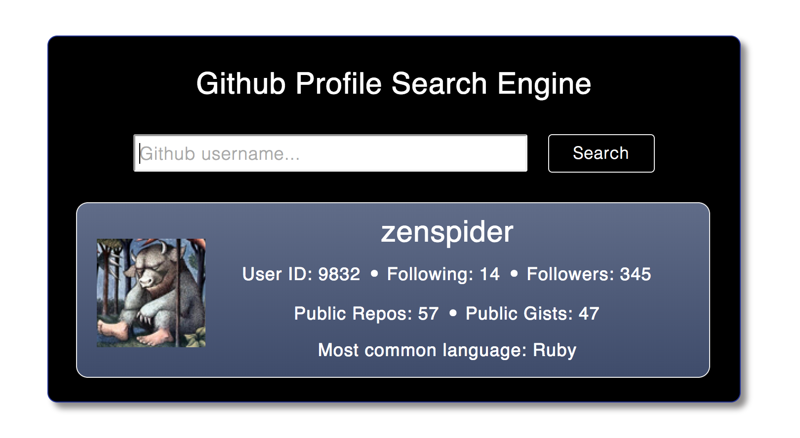

#Github Search

##Table of Contents

* [App Screenshot](#app-screenshot)
* [General Description](#general-description)
* [Functional Description](#functional-description)
* [See it Live on Heroku](#see-it-live-on-heroku)
* [How to Run the App Locally](#how-to-run-the-app-locally)
* [Browsers](#browsers)
* [License](#license)


##App Screenshot

<a href="https://raw.githubusercontent.com/nadavmatalon/github-search/master/public/images/github-search-screenshot.png">
	
</a>


##General Description

This app was built as an exercise in creating a 
[JavaScript](http://en.wikipedia.org/wiki/JavaScript) web application 
during week 5 of the course at [Makers Academy](http://www.makersacademy.com/).

The goal of writing the app was to practice implementing [jQuery](http://jquery.com) 
and [Mustache](http://mustache.github.io/) functionality, as well as working with 
[API](http://en.wikipedia.org/wiki/Application_programming_interface)s 
([Github](http://github.com) in this case).

__Update (10.9.2014):__ Re-wrote the entire app with [Angular](https://angularjs.org/) 
instead of [Mustache](http://mustache.github.io/), changed a bit of styling, and added 
a custom [jQuery UI Toolitp](http://jqueryui.com/tooltip/).

__Update (24.9.2014):__ Added 'Most Common Language' information to user profile
by implementing the [OctoKit](https://github.com/octokit/octokit.rb) gem, 
and deployed to [Heroku](http://heroku.com) to enable unlimited searches.


##Functional Description

The app gives users the ability to search for [Github](http://github.com) users 
by their username, and returns the user's avater image and data about their 
[Github](http://github.com) account, namely:

* Github User ID
* User Following
* User Followers
* Number of Public Repos
* Number of Public Gists
* Most common language/s used in user's public repos.

The users can use the hyper-linked username of a found user to redirect to that user's 
[Github](http://github.com) page.

If a given search yields no results, the app shows an appropriate message.


##See it Live on Heroku
            
A live demo of the app can be found at:

[Github Search on Heroku](http://makers-github-search.herokuapp.com/)

An earlier version of the app can be found on Github-io:

[Github Search on Github-IO](http://nadavmatalon.github.io/github-search/)


##How to Run the App Locally

To run this app you will need to clone the repo and then obtain a 
[Github API Access Token](https://help.github.com/articles/creating-an-access-token-for-command-line-use) 
and store it under a local environment variable called: `GITHUB_TOKEN`.

This `Access Token` will provide up to 5000 query requests per hour (but note that without it 
the app won't work).

Once this is done run:

```bash
$ cd github-search
$ bundle install
$ thin start
```

Then open the browser of your choice and go to:
```
http://localhost:3000/
```


##Browsers

This app has been tested with and supports the following browsers (though
it should hopefully look decent in some other browsers as well):

* __Google Chrome__ (36.0)
* __Apple Safari__ (7.0.5)
* __Mozilla Firefox__ (31.0)


##License

<p>Released under the <a href="http://www.opensource.org/licenses/MIT">MIT license</a>.</p>


