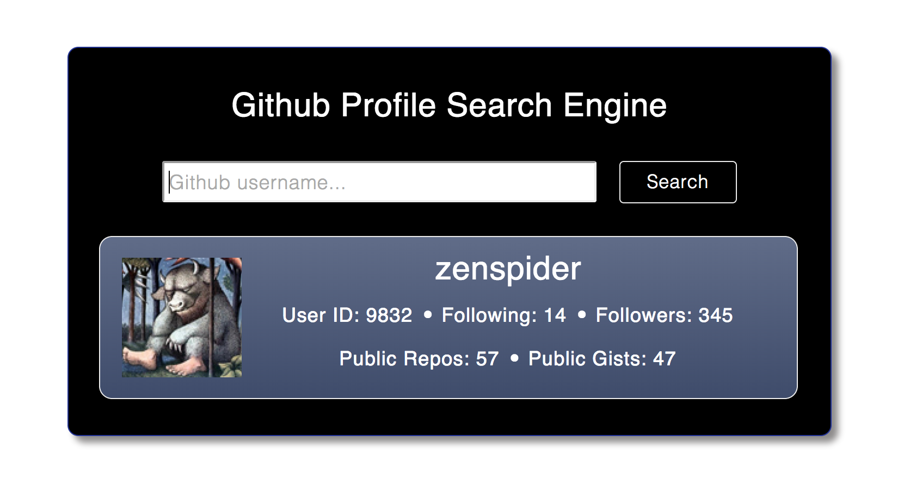

#Github Search

##Table of Contents

* [App Screenshot](#app-screenshot)
* [General Description](#general-description)
* [Functional Description](#functional-description)
* [See it Live on Github](#see-it-live-on-github)
* [How to Run the App Locally](#how-to-run-the-app-locally)
* [Browsers](#browsers)
* [License](#license)


##App Screenshot




##General Description

This app was built as an exercise in creating a 
[JavaScript](http://en.wikipedia.org/wiki/JavaScript) web application 
during week 5 of the course at [Makers Academy](http://www.makersacademy.com/).

The goal of writing the app was to practice implementing [jQuery](http://jquery.com) 
and [Mustache](http://mustache.github.io/) functionality, as well as working with 
[API](http://en.wikipedia.org/wiki/Application_programming_interface)s 
([Github](http://github.com) in this case).


##Functional Description

The app gives users the ability to search for [Github](http://github.com) users 
by their username, and returns the user's avater image and data about their 
[Github](http://github.com) account, namely:

* Github User ID
* User Following
* User Followers
* Number of Public Repos
* Number of Public Gists

The users can use the hyper-linked username of a found user to redirect to that user's 
[Github](http://github.com) page.

If a given search yields no results, the app shows an appropriate message.


##See it Live on Github
            
A live version of the app can be found (and played!) at:

[Github Search on Github-IO](http://nadavmatalon.github.io/github-search/)


##How to Run the App Locally

Clone the repo to a local folder and run:

```bash
$ cd github-search
$ bundle
$ thin start
```

Then open the browser of your choice and go to:
```
http://localhost:3000/
```


##Browsers

This app has been tested with and supports the following browsers (though
it should hopefully look decent in some other browsers as well):

* __Google Chrome__ (36.0)
* __Mozilla Firefox__ (31.0)

Please note that due to some obscure [bug](https://github.com/wycats/handlebars.js/issues/373) 
relating to [Mustache](http://mustache.github.io/), the app does not currently work 
at all on __Safari__.


##License

<p>Released under the <a href="http://www.opensource.org/licenses/MIT">MIT license</a>.</p>

